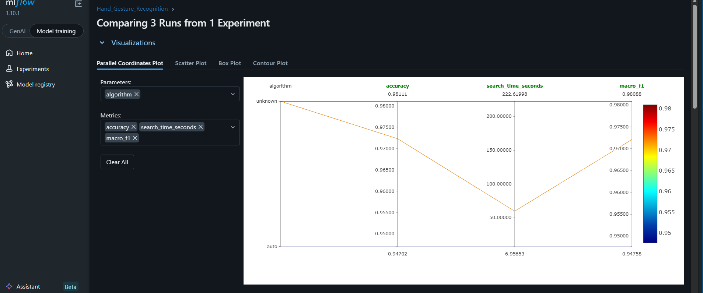
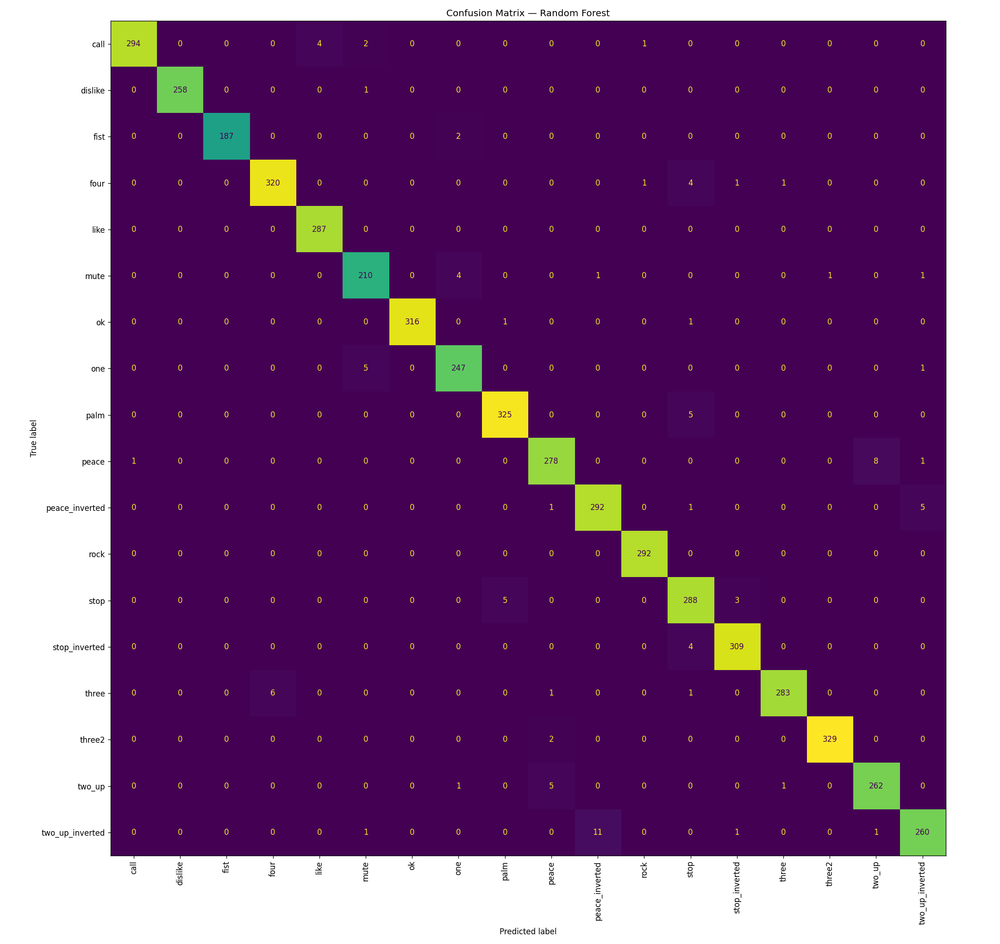

# Hand Gesture Recognition

Hand gesture classification project built from hand landmark coordinates.

## What This Repo Does

- Loads 21 hand landmarks per sample from `hand_landmarks_data.csv`
- Normalizes hand position and scale before training
- Trains and compares three classifiers: Random Forest, SVM (RBF), and KNN
- Tracks runs, models, metrics, and confusion matrices with MLflow

## Preprocessing Choice

The main challenge in this dataset is that detected hands appear at different image positions and scales. To reduce that variation, the pipeline applies two normalization steps:

1. **Geometric normalization**
   - Recenter each hand so the wrist becomes the origin
   - Scale landmarks by the distance from the wrist to the middle-finger tip
   - Leave `z` unchanged because MediaPipe already provides depth on a normalized scale

2. **Feature normalization**
   - Apply train-set z-score normalization before model fitting
   - This is especially important for distance-sensitive models such as SVM and KNN

This combination makes samples more consistent while still preserving the relative hand shape needed for classification.

## Model Choice

The selected model is **Random Forest**.

Why:

- It achieved the best test accuracy
- It achieved the best macro F1 score
- It is less sensitive to feature scaling assumptions than SVM and KNN
- It gave the strongest overall classification performance, even though hyperparameter search took longer

If training speed is the main priority, KNN is much faster to tune. If overall predictive performance is the priority, Random Forest is the better choice for this dataset.

## Model Comparison

Latest tracked results from MLflow:

| Model | Accuracy | Macro F1 | Search Time (s) |
| --- | ---: | ---: | ---: |
| Random Forest | 0.9811 | 0.9809 | 222.62 |
| SVM (RBF) | 0.9723 | 0.9721 | 59.71 |
| KNN | 0.9470 | 0.9476 | 6.96 |

### Visual Results

Metric comparison from MLflow:



Confusion matrix for the selected Random Forest model:



## MLflow Tracking

Each MLflow run logs:

- model parameters
- evaluation metrics
- serialized model artifact
- confusion matrix image artifact

Artifacts are stored per run, and confusion matrices are logged under `plots/confusion_matrix.png`.

## Main Files

- `hand_landmarks.ipynb`: end-to-end workflow for preprocessing, training, evaluation, and MLflow logging
- `mlflow_log.py`: helper used to log trained models and confusion matrices to MLflow
- `mlflow.db`: MLflow tracking database
- `screenshots/`: example MLflow UI screenshots

## Run

1. Open `hand_landmarks.ipynb`
2. Run the notebook cells in order
3. Start the MLflow UI if needed:

```bash
mlflow ui
```

Then open `http://localhost:5000` to inspect runs, artifacts, and metrics.